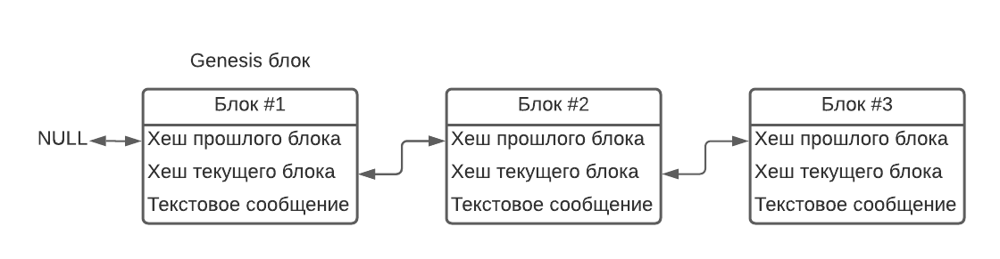

## О репозитории
Репозиторий состоит из решения Visual Studio. Решение делится на 2 связанных проекта:
- Первый проект - библиотека классов, содержащая необходимые для работы блокчейна классы 
- Второй проект - консольное приложение для демонстрации работы классов из библиотеки

## О проекте
Блокчейн - структура данных, при которой вся информация поделена на блоки. Целью проекта является воссоздание данной структуры на платформе .NET 6 и языке С# 10.
В моём проекте блокчейн используется для хранения текстовых сообщений. Для блокчейна из моего проекта будет корректна следующая схема:

